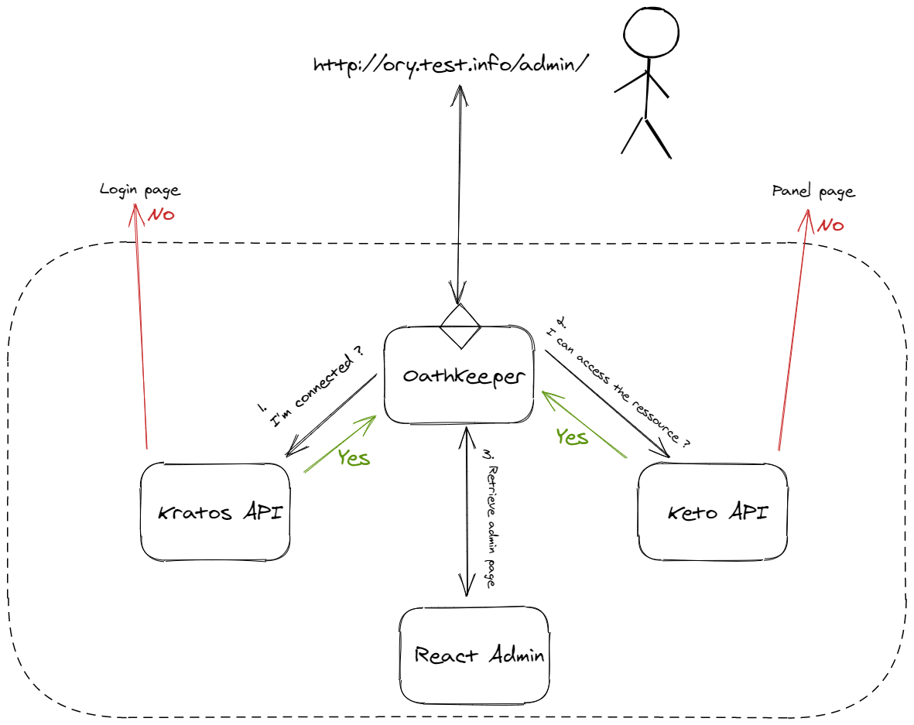

# Oathkeeper, Kratos and Keto example
## Authentification, ACL and 2FA

This repository show how create an SSO and ACL system with the Ory stack and Kubernetes.
It use the [kratos-selfservice-ui-node](https://github.com/ory/kratos-selfservice-ui-node), a fork of [mailslurper](https://github.com/pngouin/mailslurper) and a [react-admin app](https://github.com/pngouin/react-admin-ory) for the *admin* page (I'm not an front-end dev the admin page work, nothing plus).


## How to run

You need to install **[minikube](https://minikube.sigs.k8s.io/docs/start/)** and **[kustomize](https://kubernetes-sigs.github.io/kustomize/installation/)** on our machine.

```bash
$ minikube start
$ minikube addons enable ingress

# Create all the resources
$ ./build.sh | kubectl apply -f -

# It wait for Keto to be ready and add policies
$ ./add-keto-policies.sh | kubectl apply -f -
$ kubectl get ingress
NAME               CLASS    HOSTS            ADDRESS        PORTS   AGE
fake-smtp-server   <none>   mail.test.info   192.168.XXX.XXX   80      119s
oathkeeper         <none>   ory.test.info    192.168.XXX.XXX   80      119s

# Add ingress to the hosts file
$ sudo bash -c 'cat << EOF >> /etc/hosts
# ORY Minikube SSO stack
192.168.XXX.XXX    mail.test.info
192.168.XXX.XXX    ory.test.info
EOF'

# Open your browser and open http://ory.test.info/panel/welcome and http://mail.test.info
```

## How to use

Go to http://ory.test.info/panel/ and create an account, you can validate your mail on http://mail.test.info. When you create an account you have to role `user` or `admin`. Only the admin role have the right to access the admin react app.

| URL | Description |
| :--- | :--- |
| http://ory.test.info/panel/welcome | User app for create an account, login, other |
| http://ory.test.info/admin/ | Admin react app, you need the role `admin` to access |
| http://mail.test.info | Local mail panel, you will receive mail confirmation here |

This project is tested on linux with minikube version 
```
$ minikube version
minikube version: v1.21.0
commit: 76d74191d82c47883dc7e1319ef7cebd3e00ee11
```

## How it works



*(This is an outline and does not exactly reflect the reality of how the stack works)*
